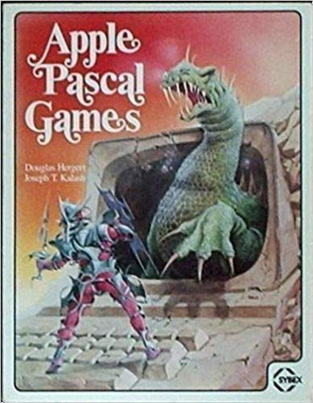

# apple-pascal-games
This repository contains programs from _Apple Pascal Games_ (1981) by Douglas Hergert and Joseph T. Kalash.

Each chapter in the book is devoted to an individual game.  Likewise, the source directories in this repository begin with
the chapter number.  For example, the directory [01-GuessIt/](https://github.com/dendrown/apple-pascal-games/tree/main/01-GuessIt)
corresponds to Chapter 1 in the book, which describes how to create a game called "Guess It."

A source directory may contain multiple versions of the same game, indicated by the presence (or absence) of a suffix on the filename:
- **No suffix** (`guessit.text`): the original Pascal game, essentially as published in the book.  Note, the original programs are all in uppercase as the original Apple II did not support lowercase characters. An interesting article on the site [Vintage Computing and Gaming](https://www.vintagecomputing.com/index.php/archives/2833/why-the-apple-ii-didnt-support-lowercase-letters) explains why.  The article was written by [Steve Wozniak](https://en.wikipedia.org/wiki/Steve_Wozniak) himself.
  
- **d3** (`guessit-d3.text`): the "∂³" (d cubed) version.  This version endeavours to keep the spirit of the chapter but represents the program as I would code it. For starters, this code will use mixed case characters as supported on later Apple II models.  Developers will often take different approaches to solve a problem (or code a game), and the "d3" version shows my approach.  Moreover, an author of a book aiming to teach programming will tend towards coding constructs that demonstrate the lesson at hand while avoiding constructs that might distract from it.  The "d3" version imposes no such constraint.

- **gs** (`guessit-gs.text`): the "graphics & sound" version.  Most of the games in the book are text-based.  This version extends the "d3" code to include graphics and sound effects.

I am testing these programs on the [LinApple](https://github.com/linappleii/linapple) Apple IIe emulator and on real hardware using my own Apple IIc.  
